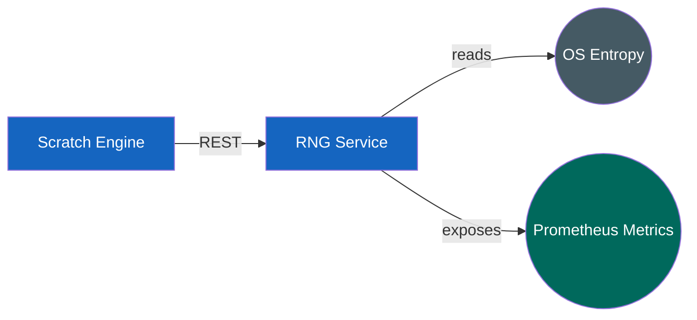

# RNG Service - Arhitecture

## Overview

The RNG Service is a **stateless** service in the demoRGS RGS platform.
It produces cryptographically secure random numbers for game engines 
and verifies its own output fairness with a chi-square test. 
It has **no database** and calls **no other services** - it only receives requests and responds.

## Where it fits

## Dependencies
| Direction | Party | Purpose |
|-----------|-------|---------|
| Inbound | Scratch Card Engine | requests random integers / doubles |
| Internal | OS entropy (`SecureRandom`) | source of randomness |
| Outbound | — | none (no DB, no downstream services) |

## Typical data flow
1. Scratch Card Engine sends `POST /api/v1/rng/integers` (`min`, `max`, `count`).
2. RNG generates the values via `SecureRandom`.
3. Each value is fed to the chi-square monitor (per-range histogram).
4. RNG returns the list of numbers.
5. On accumulated volume, the monitor runs the test; failures increment
   `rng_chisquare_failures` (scraped by Prometheus).

## Design properties
- **Stateless** → scales horizontally (each pod has its own `SecureRandom` + monitor).
- **No shared state** → no Redis; Prometheus aggregates per-pod metrics.
- **REST now**, gRPC planned for internal calls (proto kept in the repo).